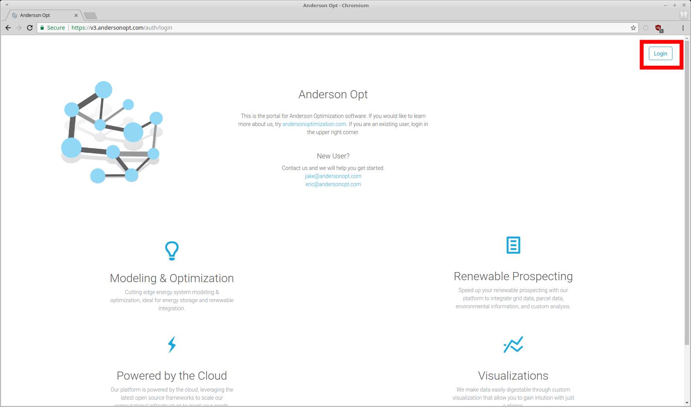
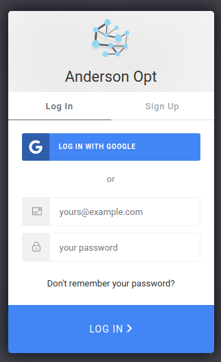
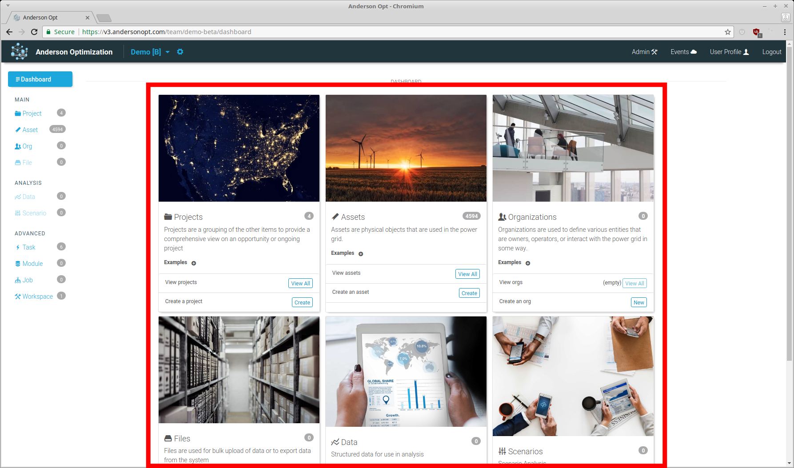
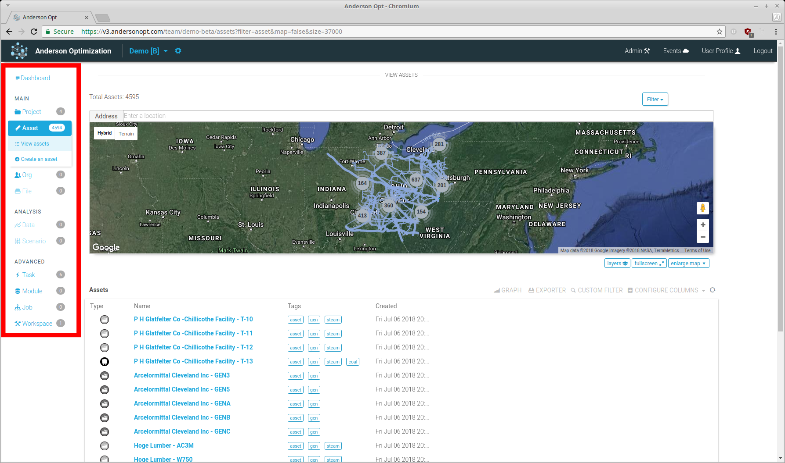

# Getting Started

## Account Creation, Team Setup

Our license fee covers the onboarding process of creating user accounts, forming teams and companies, uploading data, and configuring the application and tasks to meet specific needs.  

If you are looking to get setup with an account or do a trial of our system, please reach out to <jake@andersonopt.com> and he will assist you in the process.

## Logging In

The current version of our application is hosted here [v3.andersonopt.com](https://v3.andersonopt.com)

Click the login button and enter your authentication details.  We currently allow authentication with email and password or with a google identity.

Logging in will bring you to the dashboard of your last used team.

## Dashboard

The dashboard will give an overview of the resources that currently exist in your team.  Each resource card gives a current count for your team, a list of examples of these resources, and any navigation links to pages associated with those resources.

These resources can also be accessed in the sidebar.

## Next Steps

### Walkthrough
Walkthrough common patterns related to your product.

* [AO Prospect](ao-prospect/walkthrough.md): Software service to assist renewable developers in finding ideal sites for development.
* [AO Site Analysis](ao-site-analysis/walkthrough.md): Software service to value utility scale renewables and energy storage for a given site.

### Reference

#### User, Team, and Company management system.

* [Users](users.md): End users of our system that can be on teams and have customization options.
* [Teams](teams.md): Teams store the majority of resources and users get access to these resources by being on a team.
* [Companies](companies.md): Companies can have multiple teams and can be used to aggregate information on these teams.

#### Resources
Learn more about the resources that are the primary building blocks for our software services.

##### Primary

* [Projects](res-project/overview.md): Projects are a grouping of other resources to perform work.
* [Assets](res-asset/overview.md): Assets are physical items, often with a location, that are represented by different parameters.
* [Org](res-org/overview.md): Organizations that are involved with power systems or associated processes.
* [File](res-org/overview.md): User facing file store that is used for uploading or downloading data from our system.

##### Analysis

* [Data](res-data/overview.md): Structured data objects used within analysis.
* [Scenario](res-scenario/overview.md): A set of analysis with parameter sensitivities to be run on one or more projects or assets.
    * [Scenario Run](res-scenario/overview.md): An instantiation of a scenario with an associated project or asset.

##### Advanced

* [Task](res-task/overview.md): Our task system that performs backend work for a variety of use cases.
* [Workspace](res-task/overview.md): Our backend filestore where work is performed.

#### Components
Learn more about the components used in the web app.

* [Parameters](comp-parameter/overview.md): Allows for a variety of parameters for all our different resources.
* [Map](comp-map/overview.md): Users an add and remove layers, to draw and create sketches, and perform geo analysis tasks.
* [Table](comp-table/overview.md): Users can add and remove columns of data and sort data easily.
* [Graph](comp-graph/overview.md): Users can easily visualize tabular data.
* [Filter](comp-filter/overview.md): Allows users to filter items within a table in an arbitrary format.
* [Export](comp-export/overview.md): Users can easily export data in a variety of formats.

#### Events
Learn more about the [event system](events.md).

#### Configuration
Learn more about the custom configuration system.

* [Primary Config](config/primary.md): AO's primary configuration files that populate the user interface and store associated parameters and settings.
* [Team Config](config/team.md): Team configuration can adjust which resources are allowed and change behaviors of components such as the map.
* [Map Styles](config/map-styles.md): Allows for changing the map style at the company, team, and user level.

#### Release notes
See the [release notes](release-notes.md) for the latest changes.